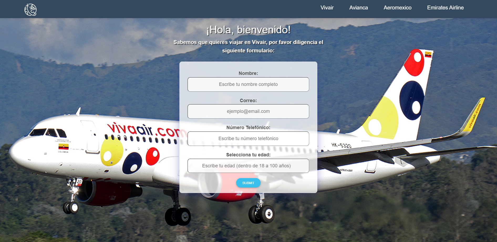
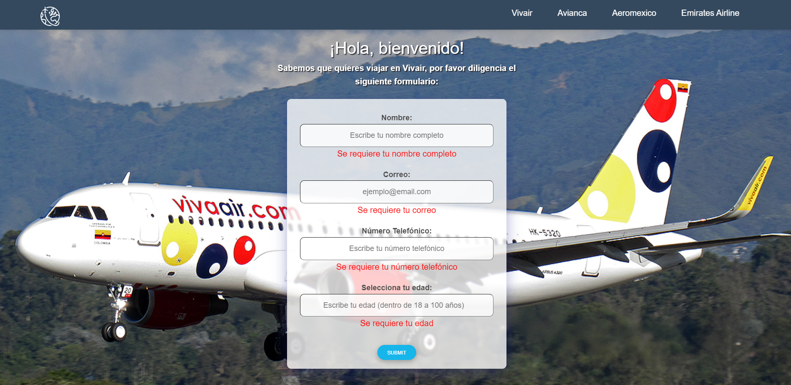
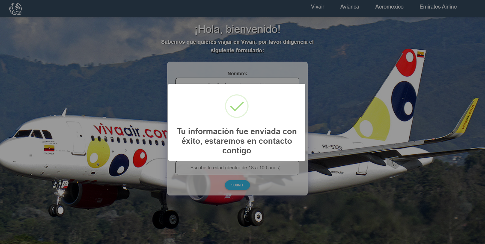
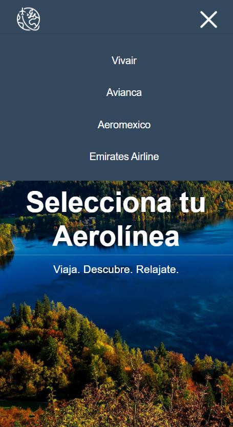
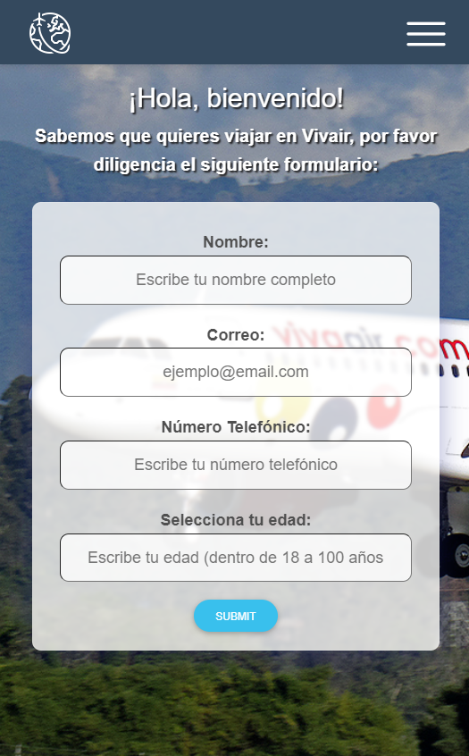
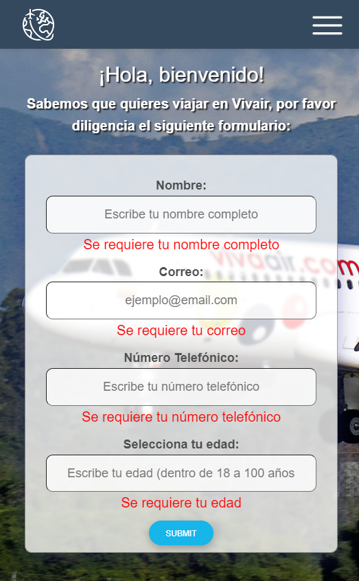
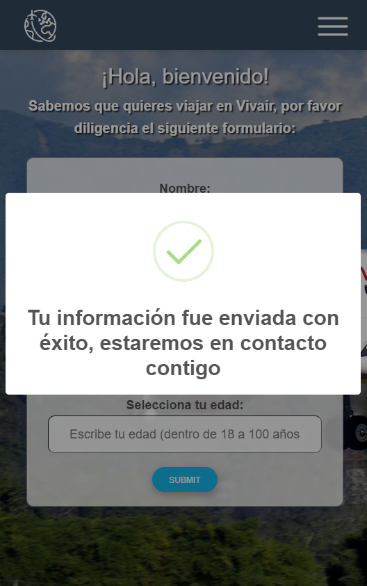

# Prueba Técnica (Front End) IT Globers.

<table width="100%" style='table-layout:fixed;'>
  <tr>
	  <td>
			
			<br>
			Proyecto técnico creado con <a href="https://github.com/facebook/create-react-app">create-react-app.</a>
	  </td>
              <td>
        
        <br>
        Utiliza <a>npm install</a> para descargar las dependencias.
   </td>
  </tr>
</table>

# Requisitos para la prueba

> App para reservar vuelos en aerolíneas.

# Menú simple responsivo.

```
💡📎 Menú de las aerolineas con un listado (<'li'></'li'>).
💡💻 Menú versión desktop mostrándose de forma horizontal
💡📱 Menú versión mobile de forma desplegable de manera vertical (desde los 920px)
💡📎 La lista de items en el menú es alimentado por un JSON que se obtiene mediante una variable.
```
> Ejemplo del fromato JSON: [{"id": 1, "name":"Vivair"}, {"id": 2, "name":"Avianca"}, {...}]


Nota: Si se desea agregar otra aerolinea (componente), se necesitará implementar su nueva ruta dentro del archivo `App.js`.


# Formulario

```
🚀 Debe contar con un mensaje de bienvenida para cada aerolinea del menú.
📃 Tiene que contener los siguientes campos en el formulario:
               1. Nombre completo.
               2. Email.
               3. Celular.
               4. Rango de edad (de 18 a 100 años).
✅ Debe tener validaciones en cada campo. (Formulario controlado).
📤 Los datos de cada campo, al momento de enviarlos deben ser imprimidos en consola.
✨ Ligthbox con duración de 5 segundos para confirmar el evío exitoso de los datos.
```

# Visualización de la aplicación.

# Desktop Version 💻

>Pantalla de Inicio/Home


#

>Aerolínea Vivair



#

>Validación del formulario



#

>Ligthbox de confirmación con duración de 5 segundos, usando librería de SweetAlert2.



#

#

# Mobil Version 📱

>Pantalla de Inicio/Home


#

>Menú desplegable



#

>Aerolínea Vivair



#

>Validación del formulario



#

>Ligthbox de confirmación con duración de 5 segundos, usando librería de SweetAlert2.



#

# Liga de App deployada ☁🚀

https://hardcore-hopper-ba4ed8.netlify.app/
